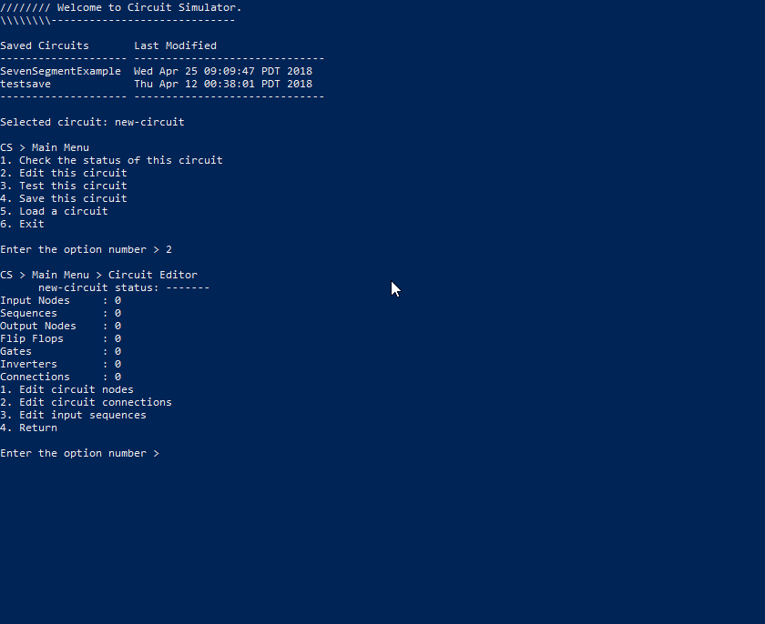
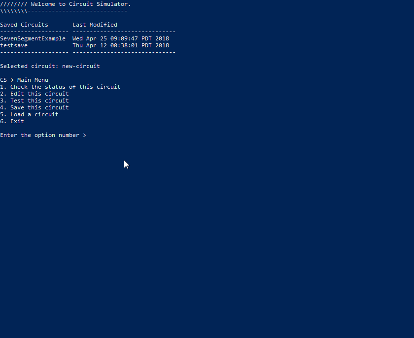

# circuit-simulator

A program that can help design simple circuits.

## Introduction

Welcome to circuit simulator. This is a program where you are able to simulate a simple circuit by creating nodes and connecting them to each other in a way that represents a working circuit. As of now, the nodes that you are able to create are input variables, output variables, D-flip-flops, "and" gates, "or" gates and inverters. You would create the circuit in this program and then you are able to test your circuit with your own input sequences and see the state of the circuit at each clock cycle. Bare in mind that currently the user interface is only implemented in the console, but someday if I ever have the time I will convert it into a graphical user interface to increase usability.

## Installation

Download the repository and compile the appropriate java files.

Ensure you are in the <b>src</b> directory and run this command

Windows:

`javac .\simulator\circuit\project\*.java`

Mac:

`javac ./simulator/circuit/project/*.java`

## Usage

Run the program with the following command, again being in the <b>src</b> directory

`java simulator.circuit.project.CircuitSimulator`

This tree represents your available options throughout the program

```
Main Menu
|
+-- check circuit status
|
+-- edit circuit
|   |
|   +-- edit nodes
|   |   |
|   |   +-- add node
|   |   |   |
|   |   |   +-- add input node
|   |   |   +-- add output node
|   |   |   +-- add d-flip-flop
|   |   |   +-- add "and" gate
|   |   |   +-- add "nand" gate
|   |   |   +-- add "or" gate
|   |   |   +-- add "nor" gate
|   |   |   +-- add "xor" gate
|   |   |   +-- add "nxor" gate
|   |   |   \-- add inverter
|   |   |
|   |   +-- remove node
|   |   +-- rename node
|   |   \-- toggle print mode
|   |
|   +-- edit connections
|   |   |
|   |   +-- add connection
|   |   \-- remove connection
|   |
|   \-- edit input sequences
|
+-- test circuit
|   |
|   +-- edit tracked nodes
|   |   |
|   |   +-- track a node
|   |   +-- untrack a node
|   |   +-- track all nodes
|   |   \-- untrack all nodes
|   |
|   \-- run test
|
+-- save circuit
+-- load circuit
\-- exit program
```

So the idea is:

+ add all the necessary nodes according to your circuit design
+ establish the appropriate connections between those nodes
+ set the appropriate sequences for your input variables
+ track the nodes that you would like to appear in the test
+ run the test

The program will then output the value of each tracked node at each clock cycle.

You can also save your circuits, and the save files will be located in a folder called "cs-saves", which will be in the src folder if you followed the instructions above, otherwise the folder will appear in the directory in which you inputted the command to run the program.

## Example

Please check out the [example](example/) folder in this repository as it provides a nice demonstration of using this program to solve the seven segment display problem.

Here are some examples of the actual program itself





