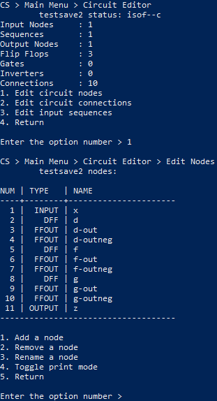
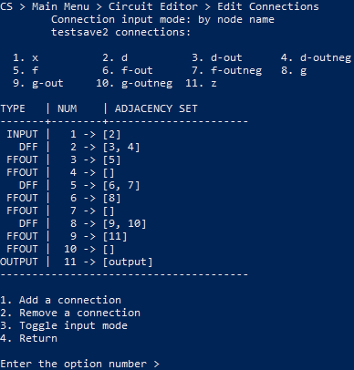

# circuit-simulator

A program that can help design simple circuits.

## Introduction

Welcome to circuit simulator. This is a program where you are able to simulate a simple circuit by creating nodes and connecting them to each other in a way that represents a working circuit. As of now, the nodes that you are able to create are input variables, output variables, D-flip-flops, "and" gates, "nand" gates, "or" gates, "nor" gates, "xor" gates, "nxor" gates and inverters. You would create the circuit in this program and then you are able to test your circuit with your own input sequences and see the state of the circuit at each clock tick. Bare in mind that currently the user interface is only implemented in the console, but someday if I ever have the time I will convert it into a graphical user interface to increase usability.

## Installation

Download the repository and compile the appropriate java files.

Ensure you are in the root directory of the repository and run these commands to compile the source files

Windows:

`javac -d build .\src\simulator\circuit\project\*.java`

Mac:

`javac -d build ./src/simulator/circuit/project/*.java`

## Usage

Now change into the build directory and run this command to run the program

`java simulator.circuit.project.CircuitSimulator`

If you already have a saved circuit from this program, running the program with the file name as an argument will start the program with your circuit already loaded.

This tree represents your available options throughout the program

```txt
Main Menu
|
+-- check circuit status
|
+-- edit circuit
|   |
|   +-- edit nodes
|   |   |
|   |   +-- add node
|   |   |   |
|   |   |   +-- add input node
|   |   |   +-- add output node
|   |   |   +-- add d-flip-flop
|   |   |   +-- add "and" gate
|   |   |   +-- add "nand" gate
|   |   |   +-- add "or" gate
|   |   |   +-- add "nor" gate
|   |   |   +-- add "xor" gate
|   |   |   +-- add "nxor" gate
|   |   |   \-- add inverter
|   |   |
|   |   +-- remove node
|   |   +-- rename node
|   |   \-- toggle print mode
|   |
|   +-- edit connections
|   |   |
|   |   +-- add connection
|   |   \-- remove connection
|   |
|   \-- edit input sequences
|
+-- test circuit
|   |
|   +-- edit tracked nodes
|   |   |
|   |   +-- track a node
|   |   +-- untrack a node
|   |   +-- track all nodes
|   |   \-- untrack all nodes
|   |
|   +-- run test
|   \-- print truth or transition table
|
+-- save
+-- save as
+-- load
+-- new circuit
\-- exit program
```

So the idea is:

+ add all the necessary nodes according to your circuit design
+ establish the appropriate connections between those nodes
+ set the appropriate sequences for your input variables
+ track the nodes that you would like to appear in the test
+ run the test

The program will then output the value of each tracked node at each clock tick.

Alternatively, you can print your circuit's truth table or transition table, depending on the type of your circuit. These tables provide very useful information about your circuit and can be used for quick testing as it covers all the combinations of your input variable values while not requiring any input sequences to be set.

You can also save your circuits, and the save files will be located in a folder called "cs-saves", which will be in the build folder if you followed the instructions above, otherwise the folder will appear in the directory in which you inputted the command to run the program.

Some remarks on using the program

+ adding a connection to nodes that can only have one input reference, such as an output variable node, will disconnect the previous connection to that node, if any
+ if you remove a connection between a node and its inverter, that inverter will be removed along with all of the inverter's connections; this effect also occurs recursively, meaning if that inverter also had its own inverter, the latter inverter is removed as well, and so on
+ truth tables are printed for combinational circuits (ones without flip flops), and transition tables are printed for sequential circuits (ones with flip flops)
+ try to keep save file names 20 characters or below; any greater will cause a formatting issue in main menu
+ try to keep all node names short; keep in mind that these names affect the formatting in the tests, such as the truth table for combinational circuits
+ editing your tracked nodes in any way is not considered a modification to your circuit, so be sure to save if you'd like to keep those changes as there would be no prompt to warn you

## Example

Below is an example that solves the seven segment display problem using a saved circuit created by this program.

Check out the [example](example/) folder for more info.


Here are some examples of the actual program itself

Nodes and connections examples:

 

Testing circuit example:


Truth and transition table examples:

 
