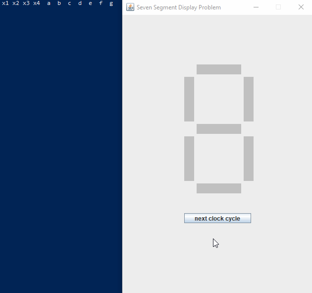
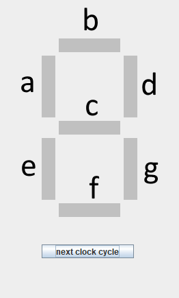

## Example

The seven segment display problem involves designing a circuit that will implement displaying the numbers 0 through 9 with seven segments arranged in a way that combinations of those segments being turned "on" will present the appropriate number.

Below is an example that solves this problem using a saved circuit created by the circuit simulator program.

## Reproduction

To reproduce this example, compile and run the `CSExample.java` file located within this directory. To do so, ensure you are in this directory, then run this command

Windows:

`javac -cp ..\src CSExample.java`

Then run the program with

`java -cp ".;..\src" CSExample`

## Usage

Now `CSExample.java` was programmed to expect a specific save file (one that I have prepared for the example) to feed it the appropriate data, but you can also use it to test your very own circuit. In order to do this, follow these steps.

+ according to the format above, name your output variables "a" through "g" appropriately
+ ensure that your circuit is ready to test
+ save your circuit with the file name "SevenSegmentExample" or whatever you like
+ copy the file into the "cs-saves" folder located inside this directory (it should be a folder that already includes "SevenSegmentExample")
+ if you named your file something other than "SevenSegmentExample" then make a change in `CSExample.java`, in its constructor it calls the method `CSFileIO.readSaveFile()`, change `SevenSegmentExample` to match your custom file name
+ compile and run just like in the instructions above
